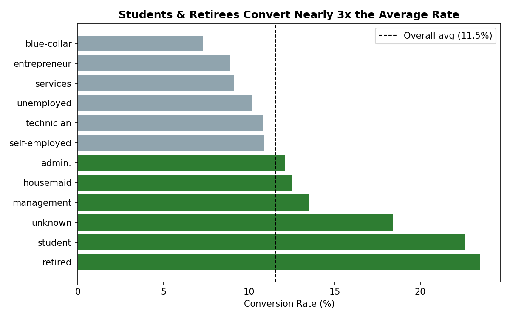
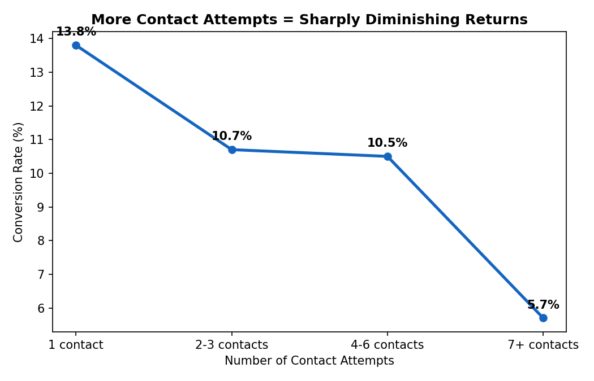
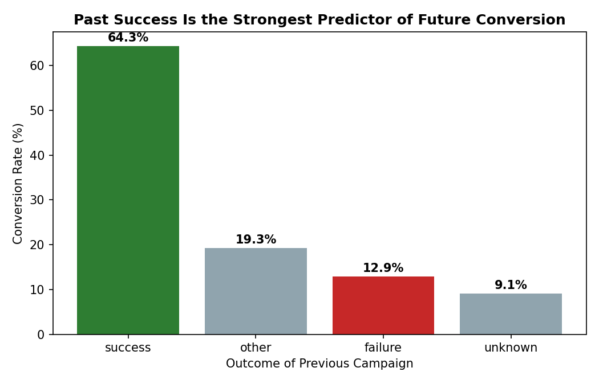

# Bank Campaign Conversion Analysis

**Tools:** Python (pandas, matplotlib)
**Dataset:** UCI Bank Marketing — 4,521 customers of a Portuguese bank, public research dataset (Moro et al., 2011), no affiliation with any employer
**Skills demonstrated:** business question framing, segmentation, campaign/operations analysis, insight communication

> Note: This analysis uses a public academic dataset (UCI Machine Learning Repository) to demonstrate analytical method — it is not affiliated with or representative of any employer's actual data.

---

## Why this project

This project looks at how a bank ran a phone-based sign-up campaign for a term deposit product — who converted, how contact strategy affected results, and what patterns the data reveals about running acquisition campaigns efficiently. It's the closest public analog I could find to the kind of operational, customer-facing question a fintech growth/strategy team deals with daily.

Overall campaign conversion rate: **11.5%** (521 of 4,521 customers contacted).

---

## Question 1: Which customer segments convert best?

```python
q1 = df.groupby("job")["Converted"].agg(["mean", "count"])
```



**Finding:** Retirees (23.5%) and students (22.6%) convert at nearly **3x** the rate of blue-collar workers (7.3%) — the two lowest-income-appearing segments outperform every professional category. This runs counter to an intuitive assumption that higher-income segments (management, self-employed) would be the best targets.

**Recommendation:** Reallocate a larger share of contact effort toward retirees and students rather than assuming higher-earning segments are automatically the best leads — likely reflects more free time/attention for phone-based offers and less friction switching savings products.

---

## Question 2: Does calling someone more times improve results?

```python
df["ContactBand"] = df["campaign"].apply(campaign_band)  # 1, 2-3, 4-6, 7+ contacts
q2 = df.groupby("ContactBand")["Converted"].mean()
```



**Finding:** Conversion is highest on the very first contact (13.8%) and **drops steadily** with every additional attempt, falling to 5.7% by the 7th+ contact. There's no point where repeated contact improves the odds.

**Recommendation:** Cap outreach at 3 contact attempts per customer per campaign — beyond that, the marginal return doesn't justify the operational cost (call center time), and repeated contact may actively hurt brand perception.

---

## Question 3: Does a customer's history with past campaigns matter?

```python
q3 = df.groupby("poutcome")["Converted"].mean()
```



**Finding:** This is the single strongest signal in the dataset. Customers who converted on a **previous** campaign convert again at **64.3%** — more than 5x the baseline rate. Customers with a prior failure still convert at 12.9%, close to average, while true cold contacts with unknown history convert at only 9.1%.

**Recommendation:** Build a simple "past converter" flag and prioritize these customers first in every new campaign — they are, by a wide margin, the highest-value list segment the bank already owns.

---

## Question 4: Is there a best time of year to run this campaign?

| Month | Conversion Rate | Contacts |
|---|---|---|
| Oct | **46.2%** | 80 |
| Dec | 45.0% | 20 |
| Mar | 42.9% | 49 |
| Sep | 32.7% | 52 |
| May | 6.7% | 1,398 |

**Finding:** Conversion swings dramatically by month — Oct/Dec/Mar/Sep all convert above 30%, while May (the campaign's highest-volume month, 1,398 contacts) converts at just 6.7%, the worst of any month. The bank is running its highest volume of calls during its least effective month.

**Recommendation:** Shift call volume away from May toward Sep–Oct and Dec, even if that means a smaller but better-timed campaign push — volume and conversion quality are currently pulling in opposite directions.

---

## Putting it together

The clearest opportunity here isn't a single fix — it's a **targeting and timing** problem. The bank is spending the most effort (May, 7+ repeat contacts, broad segment targeting) exactly where returns are weakest, while under-using its strongest lever (past converters) and best-converting months.

## What I'd do next

- Build a simple lead-scoring model combining job segment + past outcome + month to prioritize the contact list before a campaign starts
- Test capping contact attempts at 3 and measure whether total conversions actually drop or just shift earlier
- If live data were available, calculate cost-per-conversion by month to quantify how much the May-heavy scheduling is actually costing in efficiency

---

*Full analysis code in [`analysis.py`](analysis.py).*
