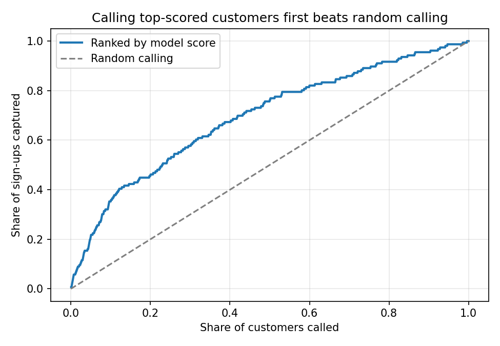
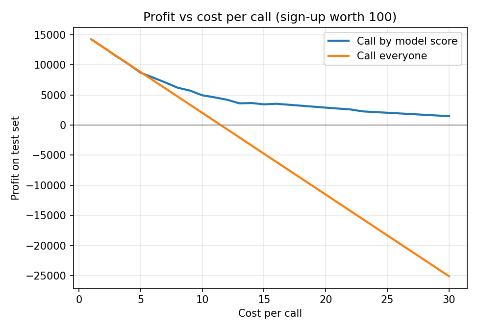
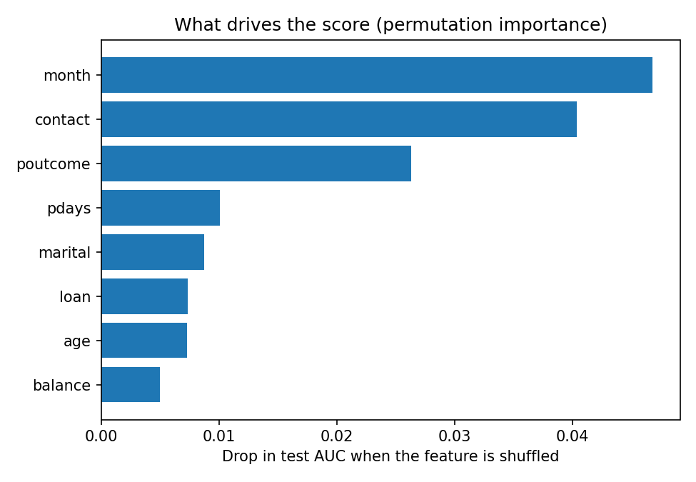

# Bank Campaign Conversion Analysis

**Tools:** Python (pandas, matplotlib, scikit-learn)
**Dataset:** UCI Bank Marketing, 4,521 customers of a Portuguese bank, public research dataset (Moro et al., 2011), no affiliation with any employer
**Skills demonstrated:** business question framing, segmentation, campaign/operations analysis, predictive modelling, cost-benefit analysis, insight communication

> Note: This analysis uses a public academic dataset (UCI Machine Learning Repository) to demonstrate analytical method. It is not affiliated with or representative of any employer's actual data.

---

## Why this project

This project looks at how a bank ran a phone-based sign-up campaign for a term deposit product: who converted, how contact strategy affected results, and what the data says about running acquisition campaigns efficiently. It's the closest public analog I could find to the kind of operational, customer-facing question a fintech growth/strategy team deals with daily.

Overall campaign conversion rate: **11.5%** (521 of 4,521 customers contacted).

The project has two parts: **Part 1** finds what drives conversion (Questions 1 to 4), and **Part 2** uses those signals to build a lead-scoring model and a profit-based call policy.

---

# Part 1: What drives conversion

## Question 1: Which customer segments convert best?

```python
q1 = df.groupby("job")["Converted"].agg(["mean", "count"])
```


**Finding:** Retirees (23.5%) and students (22.6%) convert at nearly **3x** the rate of blue-collar workers (7.3%). The two lowest-income-appearing segments outperform every professional category, which runs counter to the intuitive assumption that higher-income segments (management, self-employed) would be the best targets.

**Recommendation:** Reallocate a larger share of contact effort toward retirees and students rather than assuming higher-earning segments are automatically the best leads.

---

## Question 2: Does calling someone more times improve results?

```python
df["ContactBand"] = df["campaign"].apply(campaign_band)  # 1, 2-3, 4-6, 7+ contacts
q2 = df.groupby("ContactBand")["Converted"].mean()
```


**Finding:** Conversion is highest on the very first contact (13.8%) and **drops steadily** with every additional attempt, falling to 5.7% by the 7th+ contact. There's no point where repeated contact improves the odds.

**Recommendation:** Cap outreach at 3 contact attempts per customer per campaign. Beyond that, the marginal return doesn't justify the call-centre cost. (See Limitations: this is an association and should be tested.)

---

## Question 3: Does a customer's history with past campaigns matter?

```python
q3 = df.groupby("poutcome")["Converted"].mean()
```


**Finding:** This is the single strongest signal in the dataset. Customers who converted on a **previous** campaign convert again at **64.3%**, more than 5x the baseline rate. Customers with a prior failure still convert at 12.9%, close to average, while true cold contacts with unknown history convert at only 9.1%.

**Recommendation:** Build a simple "past converter" flag and prioritise these customers first in every new campaign. They are, by a wide margin, the highest-value list segment the bank already owns.

---

## Question 4: Is there a best time of year to run this campaign?

| Month | Conversion Rate | Contacts |
| ----- | --------------- | -------- |
| Oct   | **46.2%**       | 80       |
| Dec   | 45.0%           | 20       |
| Mar   | 42.9%           | 49       |
| Sep   | 32.7%           | 52       |
| May   | 6.7%            | 1,398    |

**Finding:** Conversion swings dramatically by month. Oct, Dec, Mar and Sep all convert above 30%, while May (the campaign's highest-volume month, 1,398 contacts) converts at just 6.7%, the worst of any month. The bank is running its highest volume of calls during its least effective month.

**Recommendation:** Shift call volume away from May toward Sep, Oct and Dec, even if that means a smaller but better-timed push. Volume and conversion quality are currently pulling in opposite directions. (Note the strong months rest on small samples, see Limitations.)

---

## Part 1 summary

The clearest opportunity isn't a single fix, it's a **targeting and timing** problem. The bank spends the most effort (May, 7+ repeat contacts, broad segment targeting) exactly where returns are weakest, while under-using its strongest lever (past converters) and its best-converting months.

---

# Part 2: Lead scoring and contact policy

**Question:** If the bank can only afford to call some customers, who should it call, and how many, to earn the most from the campaign?

**Approach**
- Built a baseline logistic regression and a gradient boosting model to score each customer's chance of signing up.
- **Removed `duration`** (call length). It is only known after the call, so using it to choose who to call would leak the answer into the model.
- Compared the models with 5-fold cross-validation and a held-out 30% test set. The model was picked on cross-validation, not on the test set.
- Turned scores into a call list: chose the score cutoff that maximised profit on out-of-fold training predictions, then measured the result on the untouched test set.
- Tested how the policy changes as the cost per call changes.

**Results**
- ROC-AUC of about 0.72 on the test set for both models (5-fold CV: 0.72 logistic, 0.73 gradient boosting). Useful, not strong.
- The top-scored 10% of customers converted at **40%** (3.5x the 11.5% average). The top 20% held 46% of all sign-ups.
- Under an assumed $5 per call and $100 per sign-up, calling by score earned about the same as calling everyone (8,695 vs 8,815 on the test set). At those numbers almost every customer is worth calling, because the break-even conversion rate is only 5%.
- Scoring pays off as calls get more expensive: at $10 per call the model policy earned 4,950 vs 2,030 for calling everyone, and at $20 it earned 2,900 while calling everyone lost 11,540.
- Strongest drivers of the score: month of contact, contact type and outcome of the previous campaign.





**Takeaway:** a scoring model is worth building when a call costs a meaningful share of what a sign-up is worth. When calls are cheap, calling nearly everyone is close to optimal. The break-even conversion rate (cost per call ÷ value per sign-up) is the number to check first.

**Assumptions:** cost per call and value per sign-up are my own assumptions, not data from the bank. That is why the result is shown across a range of costs.

---

## Limitations

- **Some segments are small.** October (46.2%) rests on 80 contacts and December (45.0%) on only 20, so I treat the strong months as leads to test, not proven rules. May's weak 6.7% rests on 1,398 contacts and is far more reliable.
- **Associations, not causes.** Conversion falls as the number of contacts rises, but customers who get called many times may simply be less interested to begin with. The "cap at 3 attempts" recommendation should be tested, not assumed.
- **The test set is small.** It holds about 157 sign-ups, so small profit differences (like 8,695 vs 8,815) are within noise.
- **No real cost data.** Call cost and sign-up value are assumptions, so the recommendations are about the shape of the trade-off, not exact profit.
- **One bank, one campaign.** The results come from a public research dataset and may not carry over to other banks or products. A real rollout would need a live test of model-ranked calls against the current approach.

## What I'd do next

- Test capping contact attempts at 3 and measure whether total conversions actually drop or just shift earlier
- Run a live A/B test of model-ranked calling against the current approach
- With real cost data, calculate cost-per-conversion by month to quantify how much the May-heavy scheduling is costing

---

## Files and how to run

| File | What it is |
| ---- | ---------- |
| `analysis.py` | Part 1: segment, contact, history and month analysis |
| `lead_scoring.py` | Part 2: lead-scoring models, call policy and charts |
| `requirements.txt` | Python packages needed |
| `chart*.png` | Charts used above |

**Data:** download `bank.csv` (the 4,521-row file, semicolon-separated) from the [UCI Bank Marketing dataset](https://archive.ics.uci.edu/dataset/222/bank+marketing) and place it in this folder.

```bash
pip install -r requirements.txt
python lead_scoring.py bank.csv
```

**Citation:** S. Moro, R. Laureano and P. Cortez. *Using Data Mining for Bank Direct Marketing: An Application of the CRISP-DM Methodology.* Proceedings of the European Simulation and Modelling Conference (ESM'2011), pp. 117-121, 2011.
